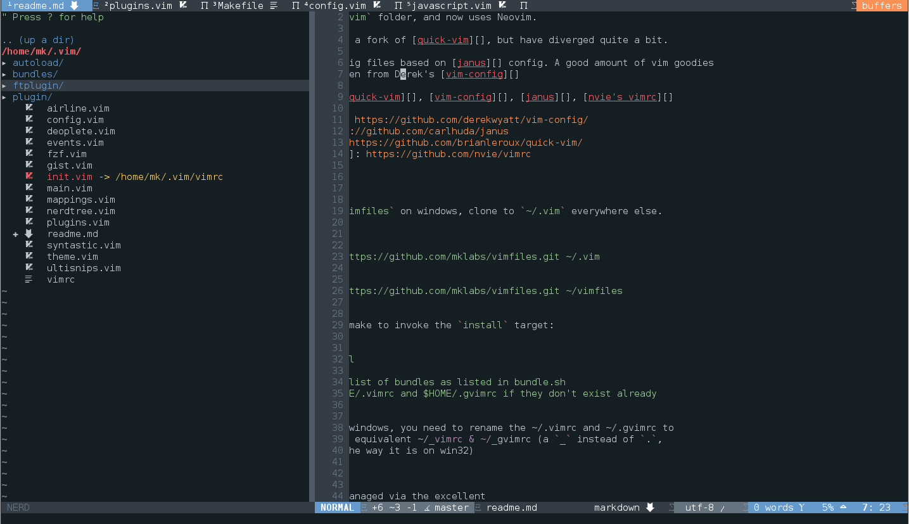

# vimfiles

This is my cross-platform, cross-editor `~/.vim` folder.

Plugins are managed via the excellent
[vim-plug](https://github.com/junegunn/vim-plug), and all specifically defined
and loaded based on the platform (win32 or unix) and editor (vim or neovim).

The default theme for unix terminals and GUI is using [Oceanic Next][]. Windows
is left as default (I still need to find the correct setup with Powerline)

---

<div align="center">
  
</div>

---

- Windows care on joining path correctly
- nvim / vim specific plugin configuration and plugins
- Small set of [plugins](#plugins) for general development
- Every bit of JS related configurations and plugins has been reworked into a
  separate repository: [vimlab/neojs](https://github.com/vimlab/neojs)
- Includes [autoload/vimfiles.vim](./autoload/vimfiles.vim)
  - higher lvl API and commands to work with vim-plug, in use in vimrc to load
    plugins based on a glob pattern.
  - `vimfiles#{join,glob,source,log,debug,end}` functions
  - `:Vimfiles` Source a list of files using glob patterns
  - `:Vimfile` Calls Plug internally, taking care of calling plug#being / plug#end
  - `:VimfilesMessage` Logs are generated during the loading / install
    process, but not displayed to the screeen to avoid the infamous
    "Enter prompt to continue" message. This commands lets you see these
    logs.

## Installation

Using Neovim: Clone to `~/.config/nvim`.
```sh
# osx / nix
$ git clone https://github.com/mklabs/vimfiles.git ~/.config/nvim
```

Using vim: Clone to `~/vimfiles` on windows, clone to `~/.vim` everywhere else.

```sh
# osx / nix
$ git clone https://github.com/mklabs/vimfiles.git ~/.vim
$ ln -s ~/.vim/vimrc ~:/.vimrc

# windows
$ git clone https://github.com/mklabs/vimfiles.git $HOME/vimfiles
$ cp $HOME\vimfiles\_vimrc $HOME\_vimrc
```

**Windows Note**: You need to rename the ~/.vimrc to its windows equivalent
~/_vimrc & ~/_gvimrc (a `_` instead of `.`). The colorscheme is left to
default and can be configured in _vimrc file.

## Plugins

Plugins are managed via the excellent
[vim-plug](https://github.com/junegunn/vim-plug), and all defined in
`plugins.vim` file.

Run `:PlugUpdate` to update or install, run `:PlugClean` for occasional clean.


- Filer: [NERDTree][] (might switch to vimfiler, or use both)
- Finder: [fzf][], fallback to ctrl-p for windows where fzf is not available
- Status bar: [vim-airline][], switched from powerline
- Theme: [Oceanic Next][] theme used by default, but configuration includes
  alternative themes such as [base16-vim][], [oceandeep][] and tomorrow
  theme.
- Git: [Fugitive][], [nerdtree-git-plugin][] and [vim-signify][] for better Git integration.
- Syntax: Syntax definitions for javascript, handlebars, markdown, cucumber
- Completion: [deoplete][] for its support of neovim's async features.
- Snippets: ultisnips
- And some other plugins like Unite, ack.vim, tcomment, vim-devicons, emmet (zencoding) ...

[NERDTree]: https://github.com/scrooloose/nerdtree
[vim-airline]: https://github.com/vim-airline/vim-airline
[fzf]: https://github.com/junegunn/fzf.vim
[Oceanic Next]: https://github.com/mhartington/oceanic-next
[base16-vim]: https://github.com/chriskempson/base16-vim
[oceandeep]: https://github.com/vim-scripts/oceandeep
[tomorrow theme]: https://github.com/chriskempson/vim-tomorrow-theme
[Fugitive]: https://github.com/tpope/vim-fugitive
[vim-signify]: https://github.com/mhinz/vim-signify
[deoplete]: https://github.com/Shougo/deoplete.nvim
[ultisnips]: https://github.com/sirver/ultisnips

## vimrc / init.vim

`init.vim` is just a symlink to `vimrc`. The first is used by neovim while the
latter is used by regular vim.

The vim configuration is split up in different files:

- main.vim - includes almost nothing and can bootstrap early config
- plugins.vim - vim-plug initialization and definitions of plugins used
- config.vim - where most of the standard vim configuration takes place
- mappings.vim - contains most of the general keybindings (not plugin specific)
- events - Autocommand stuff to hook certain action on particular Vim events
- {pluginName}.vim - contains plugin specific configuration and mappings

# Credits

It started as a fork of [quick-vim][], but have diverged quite a bit.

vim/gvim config files based on [janus][] config. A good amount of vim goodies
were also taken from Derek's [vim-config][]

**Thanks**: [quick-vim][], [vim-config][], [janus][], [nvie's vimrc][]

[vim-config]: https://github.com/derekwyatt/vim-config/
[janus]: http://github.com/carlhuda/janus
[quick-vim]: https://github.com/brianleroux/quick-vim/
[nvie's vimrc]: https://github.com/nvie/vimrc
